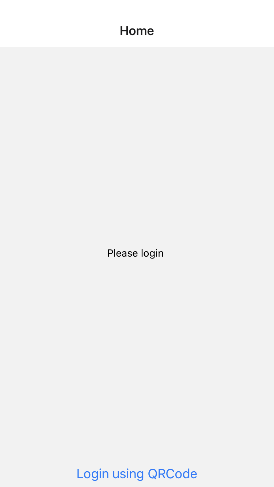
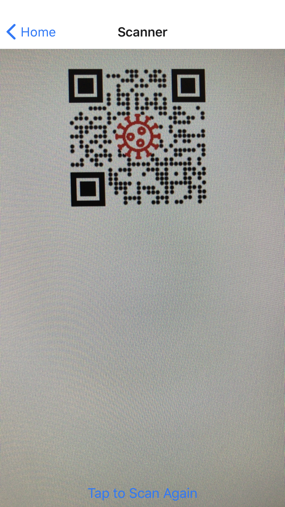
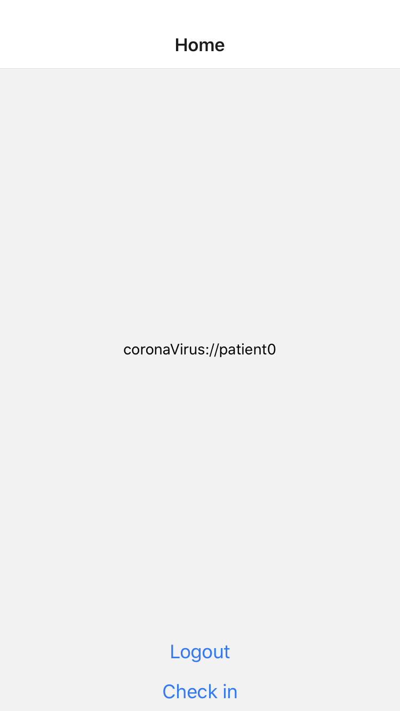
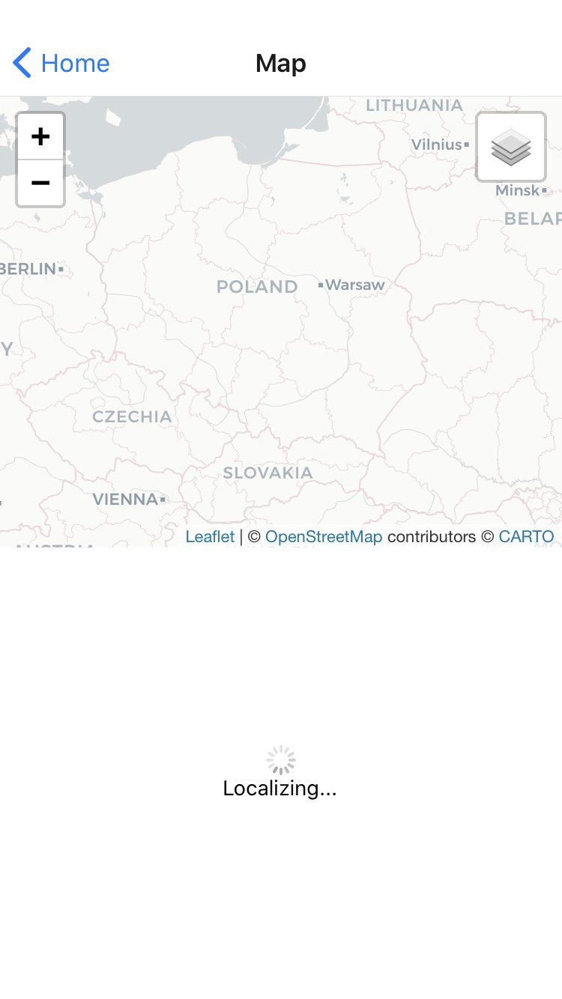
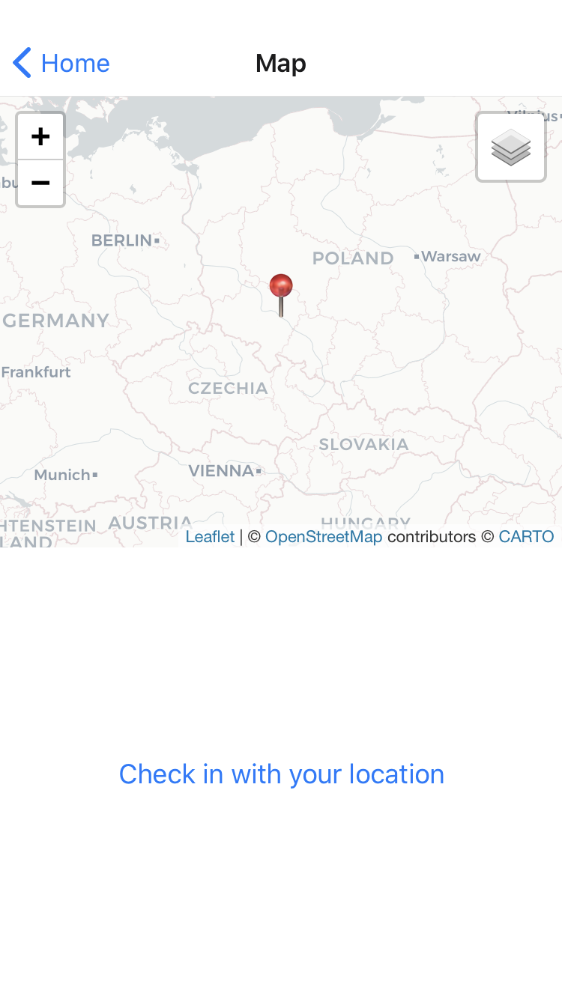
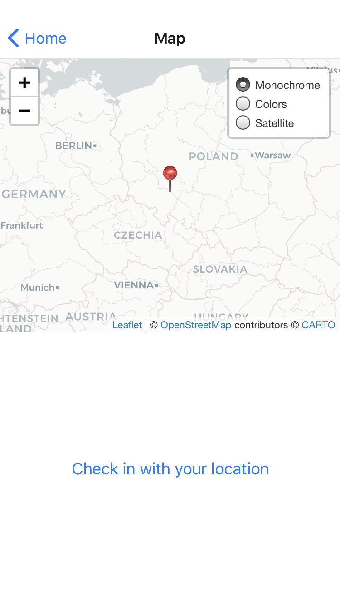
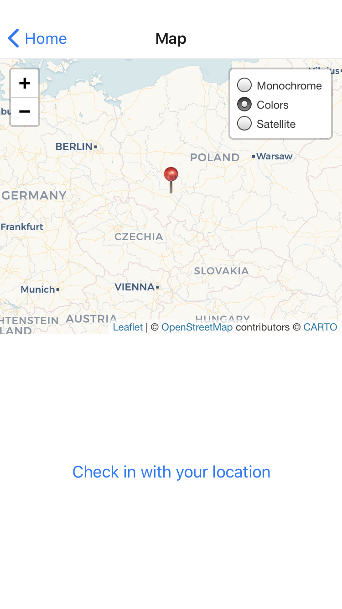
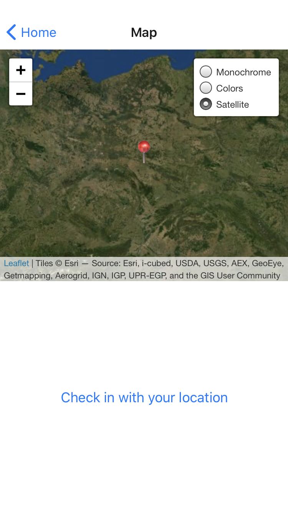
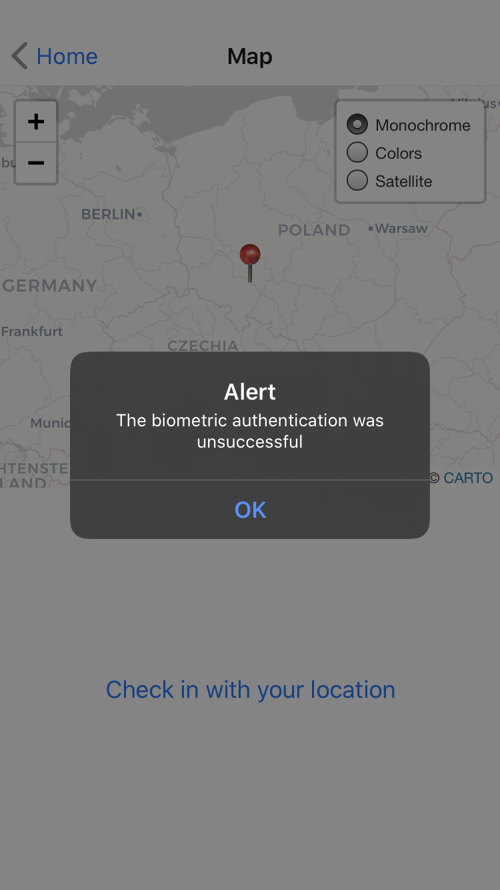
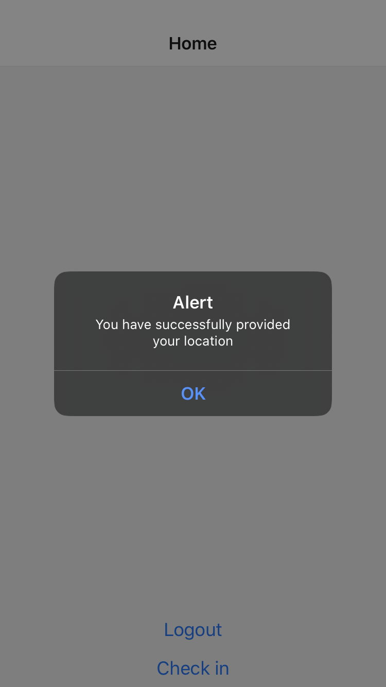

# QuarantineApp

This is a monorepo for a QuarantineApp.
It is a PoC of a helper tool for the law enforcement services during CoronaVirus outbreak.
It's main purpose is to provide a way of supervising people undergoing quarantine.
It is achieved by localizing the user's phone along with biometric authentication.

Each potentially infected person is being recored in (nonexistent) database.
The frontend panel generates QR code for the person to log in to the app.
(Currently static value of `coronaVirus://patient0`)

The patients are periodically being asked to provide current location through push notifications (not implemented).

The whole project took less than 10 hours to finish.
It was a fun way to get acquainted with expo.

## Generated QR Code

## User not logged in

## Login button pressed => navigation to QR Code reader screen

## User logged as `patient0` (Logout button should be removed for "production")

## Check in button pressed => navigation to Map screen => triggered localization

## Position found

## Map tiles menu

## Colorful map selected

## Satellite selected

## Check in with location button pressed triggers biometric authentication

## Alert showed when authentication unsuccessful

## Authentication successful, location sent to the database (not implemented) and navigation to home screen

## The project unfortunately could not be used in real life since after three unsuccessful biometric authentications the fallback method is being enabled.

